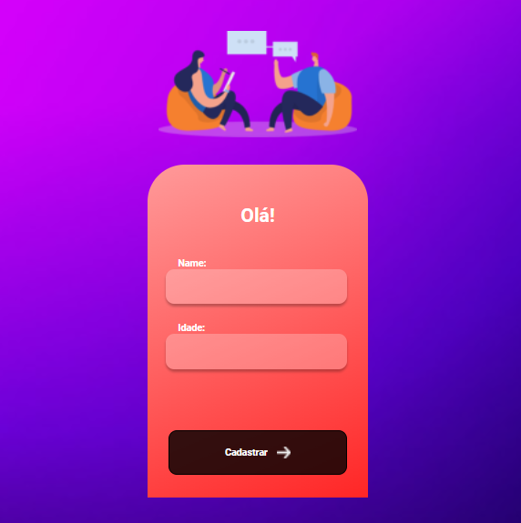

<h1>Login-Screen </h1>

Projeto foi realizado com React integrado com uma API que eu mesmo produzi, ela pode ser encontrada nos repositórios desse GitHub

Foi Usado: <strong> JavaScript | Styled Components | React Router | Yarn | Hooks |</strong>

O principal objetivo do projeto é o cadastro de usuários

